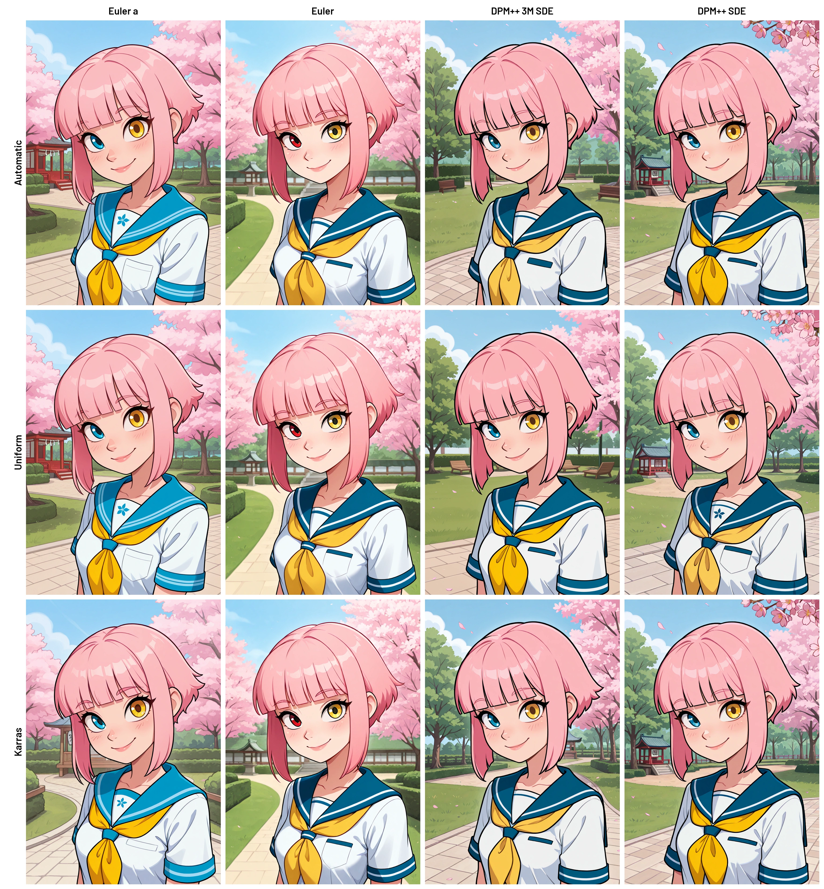
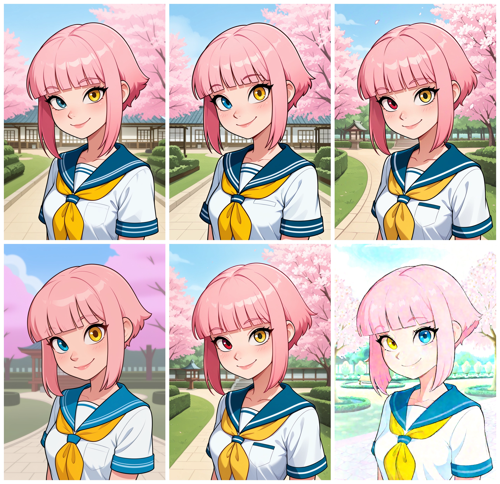

# 🔬 Sampler × Scheduler Grid (Forge)

> 💡 A script for generating image grids in Stable Diffusion Forge. Explore sampler and scheduler combinations, compare results, save individual cells, and achieve stable output — even with errors.

## 📝 Description

The script generates image grids in two modes: XY Grid and Batch Grid. XY Grid now produces two versions: one with labels and one without for cleaner visual comparison.

## ✨ Features

- 🤸‍♂️ **Flexible Modes**: XY Grid for automatic combinatorial testing and Batch Grid for custom pairs added via interface and/or manual input.
- 🔮 **Intuitive Interface**: Gradio interface with dropdowns, text fields, and buttons for easy configuration.
- 📋 **Detailed Logging**: Each pair (sampler and scheduler) generation is logged in the terminal with progress, and errors are logged in detail.
- 🪄 **Auto-Downscaling**: Grids exceeding 16380 pixels are automatically resized without quality loss to maintain performance.
- 🛠️ **Customizable Output**: Text labels for sampler and scheduler with custom font support (`Barlow-SemiBold.ttf` recommended).
- ⚠️ **Fallback Images**: Generation failures show informative error images instead of stopping the process.
- 🚰 **Duplicate Filtering**: Duplicate pairs in Batch Grid are automatically removed to prevent errors.
- 🔀 **Flexible Parameters**: Configure prompts, seed, steps (1-100), CFG (1.0-30.0), dimensions (256-2048 px), padding (0-200 px).
- 📅 **Individual Cell Saving**: Save to `outputs/cells` folder via checkbox option.
- 💾 **PNG and WEBP Support**: Choose one or both formats.
- 🏷️ **Smart Label Positioning**: Configurable label positions with collision detection.
- 🏷️ **Dual XY Grid Output**: Generates both labeled and unlabeled versions of XY Grid.
- 🛑 **Stop Generation**: Dedicated button to interrupt long-running generations.

## ⚙️ Installation
> ❗ **Important:** This is a *script*, not an extension.  
> Forge only loads `.py` files placed directly inside the `scripts/` directory.
> After cloning, you **must move the main `.py` file out of the cloned folder** and place it into `/scripts/`.

1. Clone the repository into your Forge `/scripts/` folder:
   git clone https://github.com/PupaBoo/Forge-Grid-Sampler-Scheduler

2. Navigate to the project directory:
   cd Forge-Grid-Sampler-Scheduler

3. Install dependencies:
   pip install -r requirements.txt
   
4. Move the script file `sampler_x_scheduler_grid_forge.py` from the cloned directory directly into your Forge `/scripts/` folder.

5. (Optional) Place the `Barlow-SemiBold.ttf` font in the `scripts/` folder for improved label display.

6. Restart Forge WebUI.

## 🚀 Usage

1. Launch Forge WebUI and select `🔬 Sampler × Scheduler Grid (Forge)` from the `txt2img` script dropdown.
2. Choose a mode:
   - **XY Grid**: Select samplers and schedulers for X and Y axes via dropdowns. The grid forms all possible combinations.
   - **Batch Grid**: Add sampler-scheduler pairs via dropdowns (using the "Add Pair" button) or manually in the text field (e.g., `Euler a, Automatic` per line).
3. Configure parameters:
   - Positive/negative prompt
   - Seed (leave blank for random)
   - Steps, CFG, image dimensions, padding, save format (WEBP/PNG)
   - Label positions and visibility
   - Individual cell saving option
4. Click "Generate" to create the grid. Pair progress and errors are logged in the terminal. Use "Stop Generation" to interrupt.

## 🛠 Requirements

- Stable Diffusion Forge
- Python 3.7+
- Libraries: `gradio`, `Pillow` (included with Forge)

## ⚠️ Limitations

- Works only in txt2img mode
- Very large grids may require significant VRAM
- Font rendering depends on available system fonts if Barlow font is not found

## 📜 License

MIT License © 2025 - Free to use with attribution.

## 🙌 Acknowledgments

- Built with Gradio and Pillow libraries
- Developed with AI assistance tools
- Inspired by the needs of the Stable Diffusion artist community

## 🤝 Contributing

Feedback, bug reports, and feature suggestions are welcome. Please report issues with detailed descriptions of the problem and your configuration.

## 📸 Examples

<table>
  <tr>
    <td align="center">
       
      <strong style="font-size:22px;">🧩 Batch Grid</strong>
    </td>
    <td align="center" style="padding-left:40px;">
       
      <strong style="font-size:22px;">🔄 XY Grid (With Labels)</strong>
    </td>
  </tr>
  <tr>
    <td colspan="2" align="center">
       
      <strong style="font-size:22px;">🧩 Batch Grid (Without Labels)</strong>
    </td>
  </tr>

</table>
